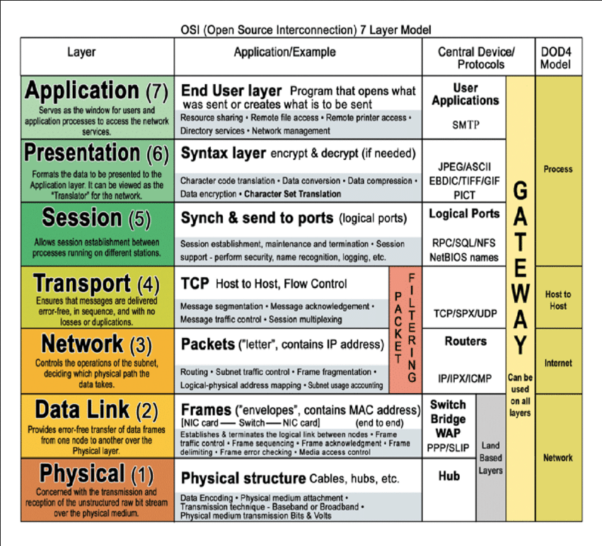

    

  eJPT-CheatSheets 
  Bartosz Pokrywka

    Usefull info and commands for eJPT cert exam

# Table of contents

- [OSI Model](#osi-model)
- [Ping Sweeps](#ping-sweeps)
- [ARP](#arp)
- [Nmap Host Discovery](#nmap-host-discovery)
  - [TCP SYN Ping](#tcp-syn-ping-half-open-scan-stealth-scan)
  - [TCP ACK Ping](#tcp-ack-ping)
  - [ICMP Echo](#icmp-echo)
  - [UDP Ping](#udp-ping)
  - [COMMANDS](#commands-that-you-will-use-the-most)
- [Port Scanning with Nmap](#port-scanning-with-nmap)
  - [Default Port Scan](#default-port-scan)
  - [SYN Port Scanning](#syn-port-scanning)
  - [No Ping Option](#no-ping-option-skip-host-discovery)
  - [Fast Scanning Profile](#fast-scanning-profile-100-common-ports)
  - [Custom Ports](#custom-ports)
  - [Scan entire port range](#scan-entire-port-range)
  - [For non-priviliged user](#for-non-privliged-user)
  - [TCP Connect Scan](#tcp-connect-scan)
  - [UDP Port Scan](#udp-port-scan)
- [Service Version & OS Detection](#service-version--os-detection)
  - [Service Detection](#service-detection)
  - [OS detection](#os-detection)
- [Nmap Scripting Engine (NSE)](#nmap-scripting-engine-nse)
- [Nmap Shortcuts](#nmap-shortcuts)
- [Nmap Firewall Detection & IDS Evasion](#nmap-firewall-detection--ids-evasion)
  - [Firewall Detection](#firewall-detection)
  - [IDS Evasion](#ids-evasion)
- [Optimizing Nmap Scans](#optimizing-nmap-scans)
  - [Host Timeout](#host-timeout)
  - [Scan Delay](#scan-delay)
  - [Timing templates](#timing-templates)
- [Nmap Output Formats](#nmap-output-formats)

# OSI Model

# Ping Sweeps
* **Pros:** ICMP ping is widely supported and quick
* **Cons:** Some host or firewalls may be configured to block ICMP traffic, limiting its effectiveness. ICMP ping can also be easily detected

**Commands**:
- *ping www.site.test*
- *fping www.site.test*

# ARP 
Address Resolution Protocol Scanning, only on local network
### Commands:
- *arp-scan -l*

# Nmap Host Discovery

## TCP SYN Ping Half-Open Scan, Stealth Scan
* **Pros:** TCP SYN ping is stealthier than ICMP and may bypass firewalls that allows outbound connections
* **Cons:** Some host may not respond to TCP SYN requests, and the result can be affected by firewalls and security devices
### Commands:
- -*sn* target  (no port scan)
- *--send-ip* (if we are on local network)
- -*iL* target list
- -*PS* TCP SYN Ping (*-PS1-1000*) <- Most Effective
- **command example: *nmap -sn -PS1-1000* target**

## TCP ACK Ping
* **Pros:** It can be used to detect hosts that block SYN packets or ICMP echo requests
* **Cons:** In certain cases networks enviroments or systems may be configured to block ACK flag set
### Commands:
- *-PA*

## ICMP Echo
### Commands:
- *-PE* (if on local network add *--send-ip*) target

## UDP Ping
### Commands:
- *-PU* target

## Commands that you will use the most:
- ***nmap -sn -v -T4* target**
- ***nmap -sn -v -PS21,22,25,80,445,3389,8080 -PU137,138 -T4* target**

# Port Scanning With Nmap

### Default Port Scan
Host discovery and scan of 1000 most common ports

**Command:** *nmap* target

### SYN Port Scanning
Nmap sends SYN request and waits for a SYN-ACK response from the target.
When it receives it, sends RST to close connection.
If the port is closed Nmap receives only RST response.
If port is filtered, it means that Nmap hasn't received any response from the target system.
That kind of scan is much faster than 3-way handshake

### No Ping Option (skip host discovery)
**Command:** *nmap **-Pn*** target (SYN flag when sudo)

### Fast Scanning Profile (100 common ports)
**Command:** *nmap **-F*** target

### Custom Ports
**Commands:** 
- *nmap -Pn **-p 80*** target
- *nmap -Pn **-p 80,445,3389,8080*** target
- *nmap -Pn **-p1-100*** target (not really usefull)

### Scan entire port range
**Command:** *nmap -Pn **-p-** -T4* target 

### For non-privliged user
**Command:** *nmap -Pn **-sS*** target

### TCP Connect Scan
Completes a 3-way handshake
Much more reliable, but loud on the network (detectable)

**Command:** *nmap -Pn **-sT*** target

### UDP Port Scan
**Command:** *nmap -Pn **-sU*** target

# Service Version & OS Detection

### Service Detection:
**Command:** *nmap **-sV*** target

**Version Intesity command:** *nmap -sV **--version-intensity 0-9*** target

### OS detection:
**Command:** *nmap **-O*** target

**Aggressive OS Guess command:** *nmap -O **--osscan-guess*** target

# Nmap Scripting Engine (NSE)
**Default script scan:** *nmap -sS -sV **-sC*** target (default scripts non intrusive, safe to run)

**Run custom script or multiple scripts:** 

- *nmap -sS -sV **--script=scriptName*** target
- *nmap -sS -sV **--script=scriptName1,scriptName2,etc*** target
- *nmap -sS -sV **--script=scriptCategory-**** (run all scripts from a category, for instance: ftp-*)

**To provide for example credentials to a script, use *--script-args* and then arguments:**
- *nmap -p445 --script smb-enum-** ***--script-args smbusername=username,smbpassword=supersecretpassword*** target

# Nmap Shortcuts
Enable OS detection, version detection, script scanning and traceroute:
- *nmap -v **-A*** target

# Nmap Firewall Detection & IDS Evasion

### Firewall Detection

To detect the firewall or fitering mechanism use:
- *nmap -Pn **-sA** -p someport* target 

### IDS Evasion

**You can use packet fragmentation:**
- *nmap -Pn -sS -sV **-f*** target
- *nmap -Pn -sS -sV **-f** **--mtu 8*** target (mtu - minimum transmision units *size*)

**Decoy IP method:**
- *nmap -Pn -sS -sV -f **--data-lenght 200 -D IP,IP,MY-IP*** target (custom data lenght)
- *nmap -Pn -sS -sV -f --data-lenght 200 **-g 53** -D IP,IP,MY-IP* target (custom source port *-g*)

# Optimizing Nmap Scans

Usefull for IDS Evasion, also for older systems to prevent them from crashing.

### Host Timeout
Some hosts simply take a long time to scan. This may be due to poorly performing or unreliable networking hardware or software, packet rate limiting, or a restrictive firewall.
Specify --host-timeout with the maximum amount of time you are willing to wait.

- **--host-timeout** value+s/m (use carefully)

### Scan Delay
This option causes Nmap to wait at least the given amount of time between each probe it sends to a given host.

- **--scan-delay** value

### Timing templates
paranoid (0), sneaky (1), polite (2), normal (3), aggressive (4), and insane (5)
- **-T<0-5>** (T3 is default)

# Nmap Output Formats

Normal: ***-oN***

XML: ***-oX*** (good for metasploit)

Grepable: ***-oG*** 

Output in three major formats at once: ***-oA***

